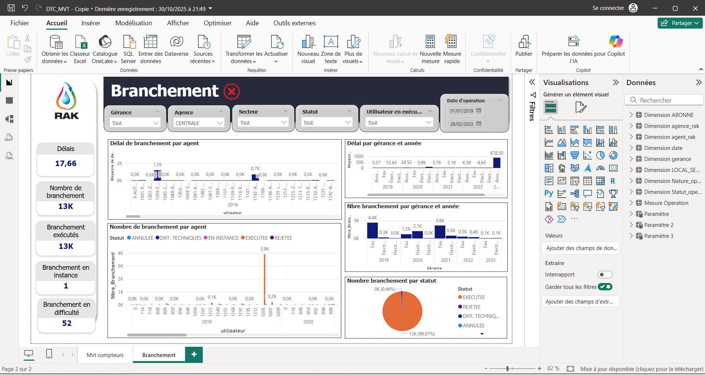
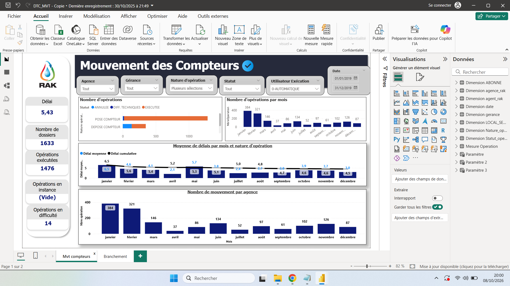

# Power BI Dashboard — Movement and Connection Analysis

[Français](#français) · [English](#english)

## Français

### Présentation
Tableau de bord Power BI interactif consacré à l’analyse des mouvements de compteurs et des branchements. Il permet de suivre les volumes d’opérations, leur statut et leurs délais de traitement à travers plusieurs filtres et axes d’analyse.

### Tableaux de bord
Le projet comprend deux vues principales :
- **Mouvement des Compteurs** — suivi des opérations, statuts, délais, périodes et axes d’analyse disponibles dans le tableau de bord.
- **Branchement** — suivi des branchements, de leur statut et des délais de traitement.

### Technologies
**Power BI** · **Data Analysis** · **Data Visualization**

### Aperçus

#### Mouvement des Compteurs

#### Branchement

### Projet Power BI
Le fichier Power BI complet est disponible dans le dépôt :

**[Télécharger le fichier PBIX](Dashboards/DTC_MVT%20-%20Copie.pbix)**

### Statut
**Terminé**

---

## English

### Overview
Interactive Power BI dashboard for analyzing meter movements and connection operations. It provides insights into operation volumes, statuses and processing times through multiple filters and analytical dimensions.

### Dashboards
The project includes two main views:
- **Meter Movements** — analysis of operations, statuses, processing times, periods and the analytical dimensions available in the dashboard.
- **Connections** — monitoring connection operations, their statuses and processing times.

### Technologies
**Power BI** · **Data Analysis** · **Data Visualization**

### Previews

#### Meter Movements

#### Connections

### Power BI Project
The complete Power BI file is available in this repository:

**[Download the PBIX file](Dashboards/DTC_MVT%20-%20Copie.pbix)**

### Status
**Completed**
